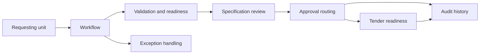

# System architecture

**Production boundary:** authentication, persistent storage, document storage, notifications, supplier controls and policy-based access would sit behind the prototype workflow. All demo records are synthetic.