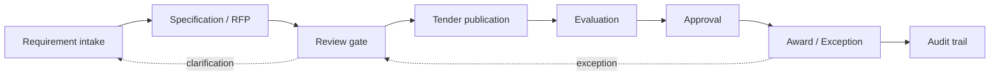

# Procurement workflow

## Control points
- Role-based ownership at each gate.
- Approval is explicit; automation does not make the decision.
- Exceptions return to a controlled review path.
- Audit events record workflow changes.

## Prototype scope
The `/app` prototype implements local request creation, record detail, workflow-state transitions and an audit timeline using synthetic data. It is a portfolio build, not a production procurement system.