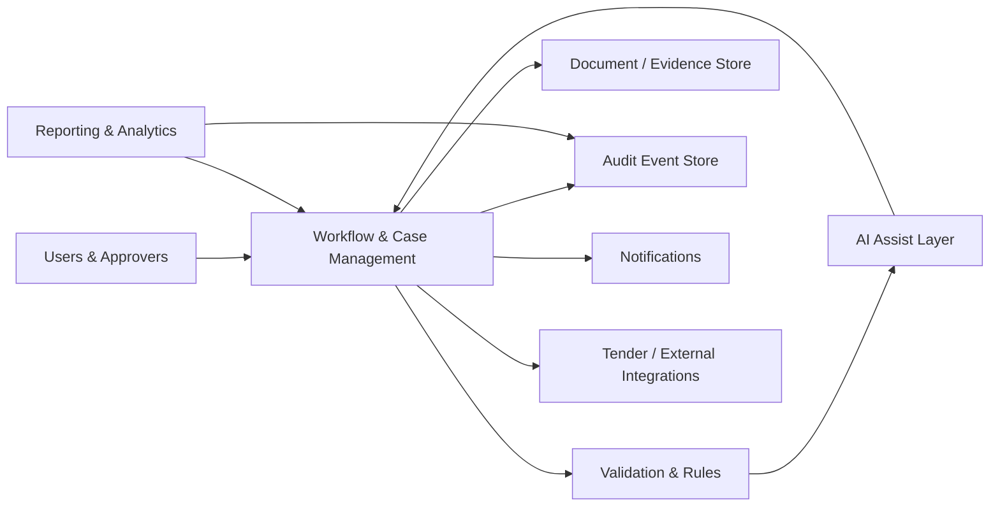

# 06 — Logical Architecture

## Architecture Principles

- workflow state is authoritative
- policy rules remain deterministic where possible
- AI outputs are advisory and reviewable
- evidence is linked to decisions
- integrations are isolated behind controlled interfaces
- audit events are append-oriented and tamper-evident where required

## Security Model

**Identity → RBAC → Workflow authorisation → Data access → Audit**

Sensitive data should be minimised, encrypted and exposed only to roles with a legitimate business need.
